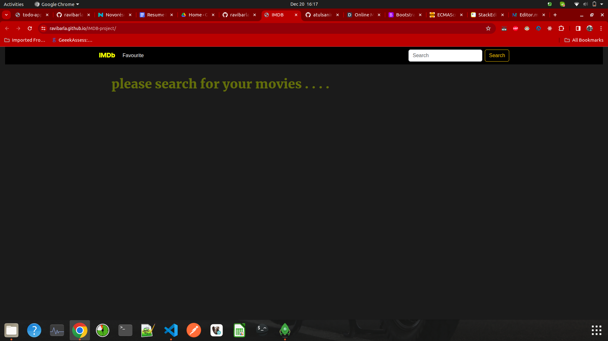
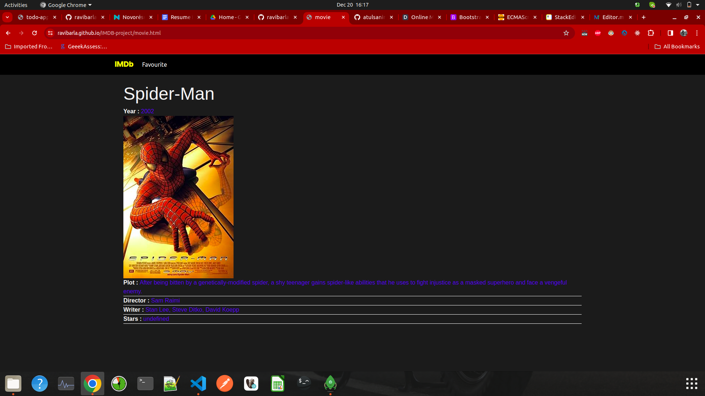
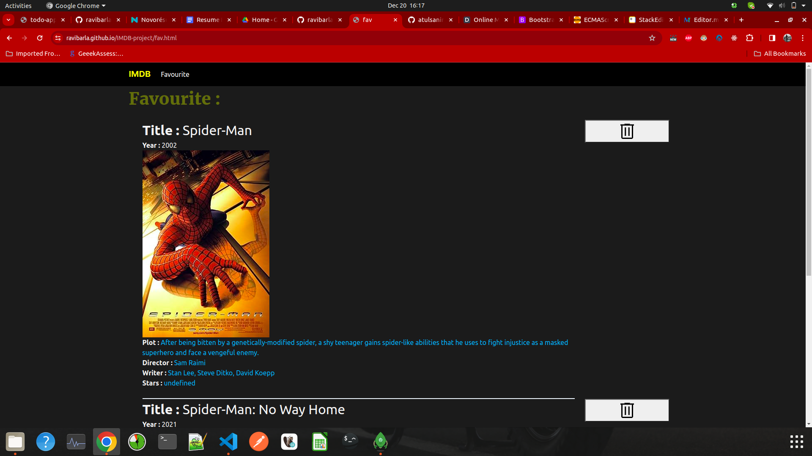
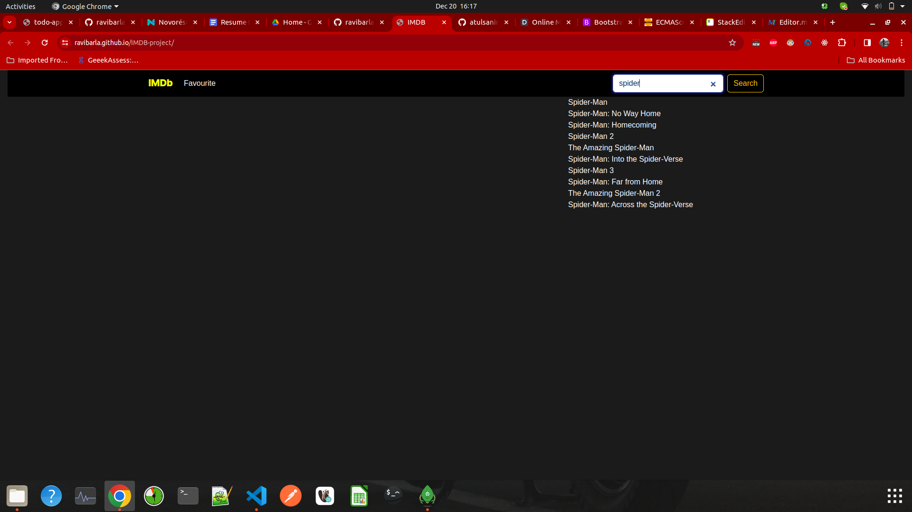
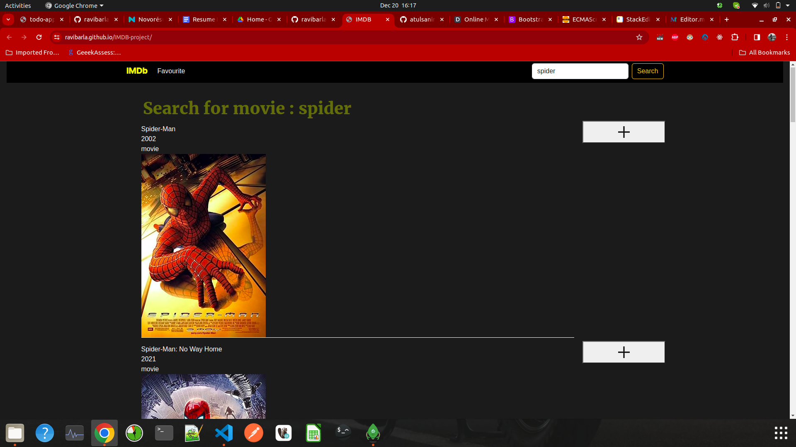

# Mini-IMDB-Clone-App

This is a mini IMDB Clone app Built using HTML,CSS and Javascript. The app uses official IMDB resource. 

## Live Demo 

https://ravibarla.github.io/IMDB-project/

## Following pages 

- Home pages
- Movie page
- Favourite page

## Features

- Input suggestion
- Redirecting to movie page on selecting a movie
- Adding as well as removing the movie to the favourite page from the home page
- Removing the movie from the favourite page

## The Api used for fetching the movie data as follows:-
- OMDB api - https://www.omdbapi.com/

## Tech

Dillinger uses a number of open source projects to work properly:

- [HTML] 
- [CSS] 
- [JQuery] 
- [JavaScript] 
- [bootstrap]

## Plugins

Instructions on how to use them in your own application are linked below.

| Plugin | README |
| ------ | ------ |
| GitHub | [plugins/github/README.md]

[//]: # (These are reference links used in the body of this note and get stripped out when the markdown processor does its job. There is no need to format nicely because it shouldn't be seen. Thanks SO - http://stackoverflow.com/questions/4823468/store-comments-in-markdown-syntax)

   [HTML]:<https://developer.mozilla.org/en-US/docs/Web/HTML>
   [CSS]:<https://developer.mozilla.org/en-US/docs/Learn/CSS>
   [jQuery]: <http://jquery.com>
   [JavaScript]: <https://developer.mozilla.org/en-US/docs/Web/JavaScript>
   [bootstrap]: <https://getbootstrap.com/>

## Screenshots
   
   - Home page
   

- Movie page

  

- favourite page

-Search Option

-Search Result

